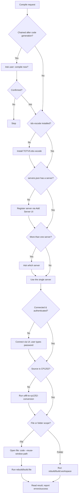

# AdvPL/TLPP Compile (tds-vscode or command line)

## Overview

Compile AdvPL and TLPP source files against a Protheus AppServer. Compilation in the Protheus ecosystem requires a connected and authenticated AppServer that receives the source into its RPO (Repository of Programs/Objects) and returns the compilation result. There are two ways to get there:

| Route | How | Needs a human? | Use when |
| --- | --- | --- | --- |
| **A — VS Code** | The **TOTVS Developer Studio for VSCode** extension (`TOTVS.tds-vscode`), reading its connection registry from `servers.json` | Yes: the user types the password in the connection prompt | No CLI scripts, the settings file is not filled, or the user asks for VS Code |
| **B — Command line** | `Scripts/pth-compile.sh` (`.ps1` on Windows) drives `advpls cli` with the server, environments and credentials from `Scripts/pth-settings.dev.json` or `Scripts/pth-settings.prd.json` (first argument `dev` / `prd`) | No — the credential was put in the file beforehand | The scripts exist and the configuration is filled (**preferred for an agent**: closes the *edit → compile → read the error* loop alone) |

See **Route selection** below. Route A, step by step — this skill orchestrates the complete path so a single "compile" request works end-to-end even on a fresh machine:

1. Ensure the extension is installed (install it if missing).
2. Ensure a server is configured in `servers.json` (configure it with the user if missing).
3. Pick the target server (ask the user when more than one exists).
4. Connect and authenticate (the **user** types the password — it is never exposed to the agent).
5. Open the target source in the editor (required before a file-scope compile).
6. Run the build/rebuild command for the file, folder, or workspace.
7. Report the result and surface any compilation errors.

## When to Use

Use this skill when:

- The user asks to **compile** or **recompile** an AdvPL/TLPP source (`compile`, `recompile`, `build`, `compilar`, `enviar para o RPO`).
- A code-generation, migration, or refactoring skill just produced/changed `.prw`, `.prg`, `.prx`, `.tlpp`, `.ppx`, `.ppp`, `.apw`, `.aph`, `.apl`, or `.ahu` files that must be sent to the AppServer.
- The user wants to validate that a source compiles cleanly against a server.
- The tds-vscode extension is not yet installed or configured and the user wants to start compiling.
- The user wants to compile **without VS Code**, into the **REST / workflow / job** environment, or into **every configured environment at once** (Route B).

**Do NOT use when:**

- The user only wants static analysis / linting without sending to the RPO.
- The target language is not AdvPL/TLPP/4GL.

---

## CRITICAL — Agent Execution Rules

> **These rules are MANDATORY.** Rules 2–3 concern Route A, rules 8–10 concern Route B; rules 1 and 4–7 apply to both.

1. **NEVER ask for, read, store, echo, or write the AppServer password.** Route A: authentication is interactive — the user types the password directly in the VS Code connection prompt; if a step needs it, instruct the user to type it in the prompt and wait — do not collect it with any tool. Route B: the password lives in `Scripts/pth-settings.dev.json` / `pth-settings.prd.json`, which the **user** fills in outside the chat; the agent never opens that file (rule 8).
2. **ALWAYS use the extension UI to register and connect servers.** Never edit `servers.json` by hand. Server registration goes through the *Add Server* assistant and connection goes through the connection prompt, so the extension validates the data and fills generated fields (`id`, `buildVersion`, `secure`, `token`) itself.
3. **NEVER write `token`, `savedTokens`, or `authorizationtoken` values into `servers.json`.** Those are generated by the extension after a successful connection. The agent does not write to `servers.json` at all — it only reads it to detect existing servers.
4. **Ensure the source is CP1252 before compiling.** The Protheus compiler only accepts Windows-1252 files. If the file was created/edited by an AI agent (UTF-8), run the `utf8-to-cp1252-conversion` skill first, otherwise compilation fails with garbled characters.
5. **Always confirm the target server with the user when more than one is registered.** Never guess.
6. **When this skill runs as a follow-up to code generation/migration/refactoring, ASK the user whether they want to compile before starting.** Do not auto-compile silently after another skill produced code.
7. **Read the result before declaring success.** A command running without error is NOT proof of a successful compile — check the compilation output/Problems for errors and warnings.
8. **(Route B) NEVER open, `cat`, read or grep any `Scripts/pth-settings*.json`** (nor a file named by `PTH_SETTINGS`) — not even while listing the `Scripts/` folder: they hold the password in plain text. To see a configuration run `bash Scripts/pth-compile.sh dev -h` (or `prd -h`), whose summary shows server and environments and never the password. Never pass credentials on a command line, and never fill a file in for the user.
9. **(Route B) Always pass `dev` or `prd` as the first argument; `dev` by default.** Compile with `prd` only when the user explicitly asks for production in this conversation. Read the `-h` summary of the file you will use before the first compile of a session, and say in the report which file, server and environment(s) were used.
10. **(Route B) Do not add your own retry loops or run compiles in parallel.** The script already waits 30 s and retries up to 3 times on a locked RPO (`COMPILEERROR-300`). Always pass an explicit path: the script's default target (`Sources/AdvPL/…`) does not exist in this repository.

---

## Bundled Reference File

This skill uses progressive disclosure. Read the reference on demand:

| Reference File | When to Read | Content |
| --- | --- | --- |
| [references/tds-vscode-reference.md](references/tds-vscode-reference.md) | Whenever you need an exact command ID, the `servers.json` schema/location per OS, the list of compilable extensions, or troubleshooting guidance | Full command-ID table, `servers.json` schema and example, OS-specific file paths, supported extensions, common compile errors and fixes |
| [references/pth-cli-reference.md](references/pth-cli-reference.md) | Route B: whenever you need the settings-file schema, the `dev`/`prd` selection, the flags/roles/exit codes of `pth-compile`, the environment-equals-RPO trap, the Windows status, or troubleshooting | How `advpls cli` works, `.ini` requirements, settings validation, `-e` roles and `-a`, exit codes, RPO lock and pacing, namespace/AppMap trap, Windows notes, troubleshooting table |

---

## Route selection

Decide before anything else.

| Situation | Route |
| --- | --- |
| `Scripts/pth-compile.sh` exists (`Scripts/pth-compile.ps1` on Windows) **and** `bash Scripts/pth-compile.sh dev -h` shows a filled configuration (a real `servidor`, a non-empty `env_default`) | **B** |
| The scripts exist but the summary shows `(nao foi possivel ler …)`, `0.0.0.0:0` or an empty `env_default` | Ask the user to create/fill `Scripts/pth-settings.dev.json` (or `.prd.json`) — or use **A** if they prefer. Do not fill it yourself and do not read it |
| No CLI scripts, or the user asks for VS Code / the IDE | **A** |

Both routes share: confirm intent when chained (Step 0), CP1252 (Step 6), read the result before declaring success.

---

## Procedure — Route A (VS Code)

Follow these steps in order. Skip a step only when its precondition is already satisfied.

### Step 0 — Confirm intent when chained after code generation

If this skill is being triggered automatically right after another skill produced or changed code (e.g. `mvc-generator`, `smartx-generator`, `advpl-to-tlpp-migration`, `refactor`), **ask the user first** whether they want to compile the generated source now. Only proceed when the user confirms. When the user invoked compilation directly, skip this step.

### Step 1 — Verify the extension is installed

Check whether `TOTVS.tds-vscode` is installed.

- If **installed**: continue to Step 2.
- If **missing**: install it (extension id `TOTVS.tds-vscode`, name "TOTVS Developer Studio for VSCode"). After install, tell the user a window reload may be required for the TOTVS activity-bar view to appear, then continue.

### Step 2 — Verify the server configuration (`servers.json`)

Locate `servers.json` (see [reference](references/tds-vscode-reference.md) for the per-OS path; default is `~/.totvsls/servers.json`, or a workspace-local copy when *Workspace server config* is enabled).

- **File missing or `configurations` array empty** → go to Step 3 (configure a new server).
- **One or more servers present** → go to Step 4 (select a server).

### Step 3 — Configure a server through the UI (only when none exists)

The extension stores connections per machine, so a configuration may legitimately not exist yet. **Always register the server through the extension UI — never edit `servers.json` by hand.**

1. Open the *Add Server* assistant: trigger `totvs-developer-studio.add` (or click `+` in the **TOTVS → Servers** view).
2. Ask the user to fill the assistant fields and save. Tell them exactly what each field expects:

| Field | What to enter | Notes |
| --- | --- | --- |
| `name` | Friendly name for the server | e.g. `local`, `p12-dev` |
| `address` | IP/hostname of the AppServer | e.g. `localhost` |
| `port` | TCP port (the *TDS/LSP* port, not the SmartClient port) | e.g. `2030` |

3. After saving, configure the *Include* folders (`.ch`/`.th` definition files) via the *Include* assistant (`totvs-developer-studio.include`) — recommended for sources that use includes.

> **Do NOT ask for the password here.** The password is requested only at connection time (Step 4). The extension fills `id`, `buildVersion`, `secure`, and `token` automatically on first connect — the agent does not write any of these.

### Step 4 — Select the target server

- **Exactly one server** registered → use it.
- **More than one** → ask the user which server to compile against (list them by `name`/`address:port`). Never assume the default or last-connected one without confirming.

### Step 5 — Connect and authenticate

Compilation requires the chosen server to be **connected and authenticated** with exclusive RPO access.

- If the server is already connected, continue to Step 6.
- Otherwise, start the connection: trigger `totvs-developer-studio.connect` (or `totvs-developer-studio.serverSelection`) for the chosen server.
- The extension will prompt for **environment**, **username**, and **password**. Instruct the user to enter these in the VS Code prompt. **The agent must not collect or transmit the password.**
- Wait for the connection to complete before continuing.

> If compilation later fails with *"It wasn't possible to obtain exclusive access to the objects repository"*, other users/JOBS are holding the RPO. See troubleshooting in the [reference](references/tds-vscode-reference.md).

### Step 6 — Ensure CP1252 encoding

Before sending to the RPO, confirm the target source(s) are Windows-1252 encoded. If any file was generated/edited in UTF-8, run the `utf8-to-cp1252-conversion` skill first. Skip only if the files are already CP1252.

### Step 7 — Open the source file in the editor

> **CRITICAL — always open the file before compiling it.** The file-scope commands `totvs-developer-studio.rebuild.file` / `build.file` have **no file-path argument**; they act on the **active text editor** (bound to `Ctrl+F9`/`Ctrl+Shift+F9` with `when: editorTextFocus`). If the target source is not open and focused, the command compiles the wrong file or nothing.

Open and focus each target source **before** running any file-scope compile.

**Preferred method — open via terminal (`code` CLI).** This is the most reliable way to open and focus a file for automation; the editor command (`vscode.open`) frequently fails in agent contexts:

- run in terminal: `code --reuse-window "/absolute/path/to/source.tlpp"`
- `--reuse-window` opens the file in the current VS Code window (does not spawn a new one)
- the file becomes the active editor, satisfying the `editorTextFocus` requirement of the file-scope compile commands

**Fallback method — `vscode.open` editor command.** Only if the terminal `code` CLI is unavailable. Note this often returns *"Failed to run command"* in agent contexts even with a valid URI and `skipCheck`:

- command id: `vscode.open`
- args: `["file:///absolute/path/to/source.tlpp"]` — a **`file:///` URI**, not a plain path
- `skipCheck: true` — required, because `vscode.open` is not in the validated palette list; without it the tool returns *"Failed to find command"*

If you need to compile several individual files, open each one (they become "open editors") and use the *open editors* command in Step 8.

> Why this matters: calling `rebuild.file` without opening the source means there is no matching active editor. Prefer the `code --reuse-window` terminal command — it reliably opens and focuses the file. The `vscode.open` editor command may fail in agent contexts (returns *"Failed to run command"* / *"Failed to find command"*), so treat it only as a fallback.

**Exception — folder/workspace compile:** when compiling a whole folder or the workspace, you do **not** need to open files. Skip this step and use the workspace/folder command in Step 8.

### Step 8 — Run the compilation

Choose the command that matches the scope (full IDs and shortcuts in the [reference](references/tds-vscode-reference.md)):

| Scope | Recompile (build everything) | Compile (incremental) | Shortcut | Needs file open/focused? |
| --- | --- | --- | --- | --- |
| Current/active file | `totvs-developer-studio.rebuild.file` | `totvs-developer-studio.build.file` | `Ctrl+F9` / `Ctrl+Shift+F9` | **Yes — open it in Step 7 first** |
| All open editors | `totvs-developer-studio.rebuild.openEditors` | `totvs-developer-studio.build.openEditors` | `Ctrl+F10` / `Ctrl+Shift+F10` | Open the target editors in Step 7 first |
| Folder / workspace | `totvs-developer-studio.rebuild.workspace` | `totvs-developer-studio.build.workspace` | — | No |

- For a single source: **open it (Step 7) → then** run the *file* command (no args — it targets the focused editor).
- For a folder or many files: use the *workspace* command — most reliable for automation, no open editor needed.
- Use **rebuild** (recompile) when in doubt — it always recompiles the source in focus.

### Step 9 — Report the result

After the command finishes:

- Inspect the TDS console / **Problems** view for errors and warnings.
- If multiple files were compiled, the *compile result* table (`totvs-developer-studio.show.result.build`) summarizes per-file status.
- Report clearly: which server/environment was used, what compiled successfully, and any failures with their messages.
- If errors are encoding-related (mojibake, invalid characters), re-run Step 6 and recompile.

---

## Procedure — Route B (command line, no VS Code)

Flags, exit codes, the settings schema and troubleshooting: [references/pth-cli-reference.md](references/pth-cli-reference.md). The agent can run this route by itself — nobody presses a key — because the credential comes from a file the user filled in beforehand.

### B0 — Confirm intent when chained

Same as Step 0: right after another skill generated or changed code, ask before compiling.

### B1 — Check the configuration (never open the JSON)

```bash
bash Scripts/pth-compile.sh dev -h | sed -n '/^Configuracao/,/^Exemplos/p'      # Windows: .\Scripts\pth-compile.ps1 dev -h
```

It shows the file path, the server, `env_default` and the optional `env_rest` / `env_workflow` / `env_job` — never the password. `(nao foi possivel ler …)`, `0.0.0.0:0` or an empty `env_default` means that file is missing or unfilled: ask the user to fill it, or fall back to Route A. **Never read the file and never fill it in for them.**

- **Settings selection.** `dev` → `Scripts/pth-settings.dev.json`, `prd` → `Scripts/pth-settings.prd.json`. It must be the **first** argument, before any option. Without it the script uses `PTH_SETTINGS` and then `Scripts/pth-settings.json`, which does not exist in this repository — so always pass one.
- **`dev` and `prd` may point to the same place.** On 2026-09-25 both showed the same server (`minerasul215598.protheus.cloudtotvs.com.br:10214`) and the same `env_default` (`CQSLH5_GWORKS`). Check `-h` of the file you use; do not assume `dev` is isolated from production.
- **No execute bit.** The repository sits in a Google Drive folder and the `.sh` scripts are not executable: call them as `bash Scripts/pth-compile.sh …`.

### B2 — Ensure CP1252

Same as Step 6: sources generated or edited by an agent are UTF-8 and must be converted with `utf8-to-cp1252-conversion` first.

### B3 — Choose path and environment

- **Path:** the narrowest that covers the change, always explicit (folder = recursive). Never rely on the default target.
- **Environment:** none = `env_default`. To test a REST route compile with `-e rest`; also `-e workflow`, `-e job`, or a name listed in `environments`. `-e` can repeat. `-a` compiles into **every configured** `env_*`, without repeating equal ones, and does not combine with `-e`.
- **Each environment has its own RPO** — compiling into one does not publish to another. If a route answers with old code after a "successful" compile, suspect the wrong environment first (see the reference).

### B4 — Run

```bash
bash Scripts/pth-compile.sh dev Sources/Templates/ConsultaSql                 # env_default of pth-settings.dev.json
bash Scripts/pth-compile.sh dev -e rest Sources/Templates/ConsultaSql/Api     # the environment the REST Server serves
bash Scripts/pth-compile.sh dev -a -r Sources/Templates/ConsultaSql           # recompile in every configured environment
bash Scripts/pth-compile.sh prd Sources/Templates/ConsultaSql                 # production — only when the user asked for it
```

A locked RPO makes the script wait 30 s and retry up to 3 times on its own; do not add loops and do not run two compiles at once.

### B5 — Read the result

- The exit code is `0` only when **every** environment compiled; with several environments the output ends with a `=== resumo ===` per environment, and the exit code is the first failure's. All environments run even if one fails.
- Compile errors come on stdout with file and line: fix and repeat.
- `COMPILEERROR-300 Failed to open repository` after the retries → another session or the REST service holds the RPO. Tell the user; do not loop. (A compile that *succeeded* into the REST environment needs no restart: the REST service serves the new code by itself within up to 120 s — wait and retry the route instead of asking for a restart.)
- A compile proves syntax and that every referenced symbol exists in the RPO — **not** that it works. Behavior, SQL column names inside strings, and a missing `using namespace` (compiles, then the first call fails at runtime with `cannot find function U_X in AppMap` — an AppServer limitation; call again to tell) only show when it runs: use `advpl-tlpp-exec-sql-query` to look at real data.
- Report: server, environment(s), what compiled, failures with their messages.

### B6 — Windows

Use `Scripts/pth-compile.ps1` (same `dev`/`prd` first argument, same flags, same settings files; the choice stays inside the script and never touches `$env:PTH_SETTINGS`). **It has never been run on Windows.** The top of the file carries a status block and a validation script: while that block is there, tell the user to run it and ask for the output — do not claim the script works.

---

## Decision Flow

This diagram is **Route A**. Route B is B0–B5 above; the route is chosen in **Route selection**.



## Anti-patterns

- **Asking for the password.** Never. The user types it in the VS Code prompt.
- **Editing `servers.json` by hand.** Always register/connect through the extension UI; manual edits can corrupt the registry and skip validation.
- **Writing tokens into servers.json.** Tokens are extension-generated; manual values corrupt the registry.
- **Auto-compiling after code generation without asking.** When chained, always confirm with the user first.
- **Calling `rebuild.file`/`build.file` without opening the file first.** They act on the active editor only — open the source with `code --reuse-window "/path/to/source"` in the terminal first (preferred), or use the workspace/folder command.
- **Relying on `vscode.open` to open the file.** It often returns *"Failed to run command"* in agent contexts. Prefer `code --reuse-window` in the terminal; use `vscode.open` (URI + `skipCheck: true`) only as a fallback.
- **Compiling without a connected server.** The build commands silently fail or error without an authenticated connection.
- **Declaring success without reading the result.** Always verify the console/Problems output.
- **Compiling UTF-8 files.** Convert to CP1252 first.
- **Guessing the server when several exist.** Always confirm with the user.
- **(Route B) Reading any `Scripts/pth-settings*.json`** to "check the configuration" — they have the password. Use `bash Scripts/pth-compile.sh dev -h` (or `prd`).
- **(Route B) Filling a settings file for the user, or asking for the password in chat.** The user fills the files outside the conversation.
- **(Route B) Compiling with `prd` without an explicit request, or omitting `dev`/`prd`** (the fallback `pth-settings.json` does not exist).
- **(Route B) Compiling into the wrong environment and concluding the fix did not work.** Each environment has its own RPO; check which one the failing thing runs in (`env_default` for the WebApp, `env_rest` for REST) before touching the code again.
- **(Route B) Relying on the default target.** `Sources/AdvPL/Global` / `Projects` do not exist in this repository; always pass a path.
- **(Route B) Wrapping the script in a retry loop.** It already retries a locked RPO 3× with 30 s between; more loops only prolong the lock.
- **(Route B) Treating exit code `0` as "it works".** It means it compiled — see B5.
- **(Route B) Claiming the `.ps1` scripts work.** They have never run on Windows; send the user through the validation script at the top of the file.
